```python
%matplotlib inline 
#To plot within the notebook
from sklearn.decomposition import PCA # Surmoning the Principal Component Gods
import skimage.transform as imtran # The wizard of Image transformation. They do a mean Image resize
import numpy as np # Our package who art in numbers
import matplotlib.pyplot as plt # Let there be plots...
from matplotlib import style
style.use('fivethirtyeight')
from PIL import Image # This one is a bit boring, Opens images, bla bla bla, the usual.
from mpl_toolkits.mplot3d import Axes3D # 3D projections that are actually better than imax!
import glob #An earth wannabe, 'global environment' package.
import time
import sys
from scipy.stats import multivariate_normal
from sklearn.mixture import GaussianMixture
width = 128
```

GAUSSIAN MIXTURE MODELS ON EVERYBODY IS A CRIMINAL.

Here, I use PCA to reduce the dimensionality of my images to 2 to allow for easy use in the Gaussian model and for plotting purposes.

I also standardize my images to 128 by 128 and set them to monochrome.


```python
color_set = ['black','dimgrey', 'brown','darkgrey', 'y', 'red', 'blue', 'green','orchid','orange','maroon',
             'khaki', 'peru', 'cyan']
crime_list = {"M":"Murder/Assault/Bartery","F":"FRAUD/FAKING DOCUMENTS",
              "T":"THEFT/LACERNY/BUGLARY","S":"SEXUAL MISCONDUCT","D":"DUI","N":"Narcotics/Drugs"}

crime_num = {"M":0,"F":1,"T":2,"S":3,"D":4,"N":5}

crime_bn = {0:"Murder/Assault/Bartery",1:"FRAUD/FAKING DOCUMENTS",
              2:"THEFT/LACERNY/BUGLARY",3:"SEXUAL MISCONDUCT",4:"DUI",5:"Narcotics/Drugs"}

crime_params = {"M":[],"F":[],"T":[],"S":[],"D":[],"N":[]}

def display_image(images, im_names, rows = 1, columns = 3, size = (18,18)):
    %matplotlib inline
    fig=plt.figure(figsize=size)
    count = 0
    for i in range(1, columns*rows +1):
        fig.add_subplot(rows, columns, i)
        plt.imshow(images[count])
        plt.title(im_names[count])
        count+=1
    plt.show()
    
def standard_importer(path='./DAYTONA-16-12-2018'):
    image_list, image_names = [], []
    for file in glob.glob(f'{path}/*'):
        image_resized = imtran.resize(np.array(Image.open(file).convert('L')), (width,width), mode = "reflect")
        image_list.append(image_resized)
        image_names.append(file.split('\\')[-1])
    return np.array(image_list), np.array(image_names)
MUGSHOTS, crime_names = standard_importer()
display_image(MUGSHOTS, im_names=crime_names,columns = 4,rows= 4)
```


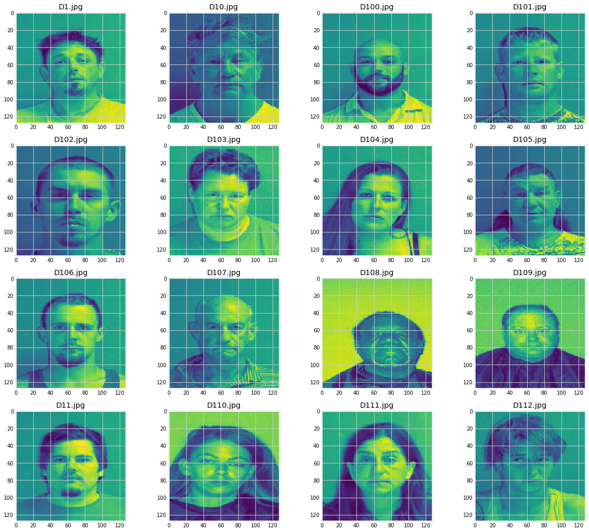


The implementation of PCA and some utilitiy functions to infer probabilities from the gaussians are fitted here. The fitted gaussians span the whole field of the data but they have various peaks depending on the components that they capture most.  Depending on the location of a component point, you can infer the probability of any component being in any category. They serve as our expectation functions. This is all done for us by GMM further below. 

Currently much of the work here is setting up the plotting tools and the reductor.


```python
#These save instances of PCA used for each picture to keep consisten. I will reuse the instances for deconstruction.
#While I technically understand that I can reuse the same 2d and 3d instances, I chose to go by this just for a peace
#of mind. I wanted to keep my instances in check.
image_vars = []
pc_ins2, pc_ins3 = [], []
def pca_reduction(pic, ndim=2):
    #The amount of explained variance is relative to the total amount of explained variance by the components 
    main_fit = PCA().fit(pic)
    pca_reduction.total_components = sum(main_fit.explained_variance_)
    var_exp = [(i/pca_reduction.total_components)*100 for i in sorted(main_fit.explained_variance_, reverse=True)] 
    image_vars.append(var_exp)
    #print(f"Total variance captures when decomposing: {pca_reduction.total_components}%")
    pca_reduction.pca = PCA(n_components =ndim)
    if ndim == 2:
        pc_ins2.append(pca_reduction.pca)
    else:
        pc_ins3.append(pca_reduction.pca)
    return pca_reduction.pca.fit_transform(pic)
def dict_printer(d, name = "test"):
    print("\n --------------------------------------------------------------------------------------------------")
    for k, v in list(d.items()):
        print("The probability of {} commiting {} is {}%".format(name, k, v))
    print("--------------------------------------------------------------------------------------------------\n")
    return None
```


```python

def plot_2d_image(ax,image_2d, p=False):

    x_list, y_list = [], []
    for point in image_2d:
        x_list.append(point[0])
        y_list.append(point[1])
    ax.scatter(x_list, y_list, marker='1')
    if p:
        ax.plot(x_list, y_list)
    return None

def plot_contours(ax, Xs, countours = True, sam_size =1000):
    if contours:
        #The contours take a long time to compile so I am taking a random, smaller sample to compute contours
        print("Contour Plots")
        Xs = [Xs[np.random.choice(range(len(Xs)),1)] for i in range(sam_size)]
        x,y = np.meshgrid(np.sort([Xs[0] for x in Xs]),np.sort([Xs[1] for x in Xs]))
        XY = np.array([x.flatten(),y.flatten()]).T
        progress_bar()
        count=1
        for m,c in zip(means,covariances):
            multi_normal = multivariate_normal(mean=m,cov=c)
            ax.annotate(list(crime_list.values())[count], m,  ha='right', va='bottom',
                bbox=dict(boxstyle='round,pad=0.5', fc='yellow', alpha=0.5),
                arrowprops=dict(arrowstyle = '->', connectionstyle='arc3,rad=0'))

            ax.contour(np.sort(Xs[:,0]),np.sort(Xs[:,1]),multi_normal.pdf(XY).reshape(sam_size,sam_size),alpha=0.3)
            ax.scatter(m[0],m[1],c='grey',zorder=10,s=100)
            count+=1
    return ax


def plot_components(image_set, names, dimm=2, plot=True, size =(10, 10) ):
    low_dim = []
    if dimm==2 and plot:
        fig = plt.figure(figsize = size, dpi=80, facecolor='w', edgecolor='k')
        ax = fig.add_subplot(111)
        ax.set_title("2 Dimension Image Plot")
        ax.set_xlabel("1st Principle Component")
        ax.set_ylabel("2nd Principle Component")
        
    if dimm ==3 and plot:
        fig = plt.figure(figsize = size, dpi=80, facecolor='w', edgecolor='k')
        ax = fig.add_subplot(111, projection='3d')
        ax.set_title("3 Dimension Image Plot")
        ax.set_xlabel("1st Principle Component")
        ax.set_ylabel("2nd Principle Component")
        ax.set_zlabel("3rd Principle Component")
    for i in range(len(image_set)):
        ld = pca_reduction(image_set[i], ndim = dimm)
        vars_e = [(i/pca_reduction.total_components)*100 for i in sorted(pca_reduction.pca.explained_variance_, reverse =True)]
        totv = sum(vars_e)
        #print('-'*100)
        #print(f"Component variance explained in order: {vars_e}")
        #print(f"{names[i]} Total variance explained by {dimm} components =  {totv}% \n")
        #print('-'*100)
        low_dim.append(ld)
        if dimm==2 and plot:
            plot_2d_image(ax,ld)
    return low_dim
```

I had a suspicion that there would be extensive overlap and sure enough, there was. I dont think there is any significant difference between the face of a murderer, DUI convict among others. They are all too similar to tell appart. My theory is that my model will not be accurate but I could be wrong so let us test it. Can we tell crimes from faces? 


```python
two_dimensional_data = plot_components(MUGSHOTS,crime_names, dimm =2)
```


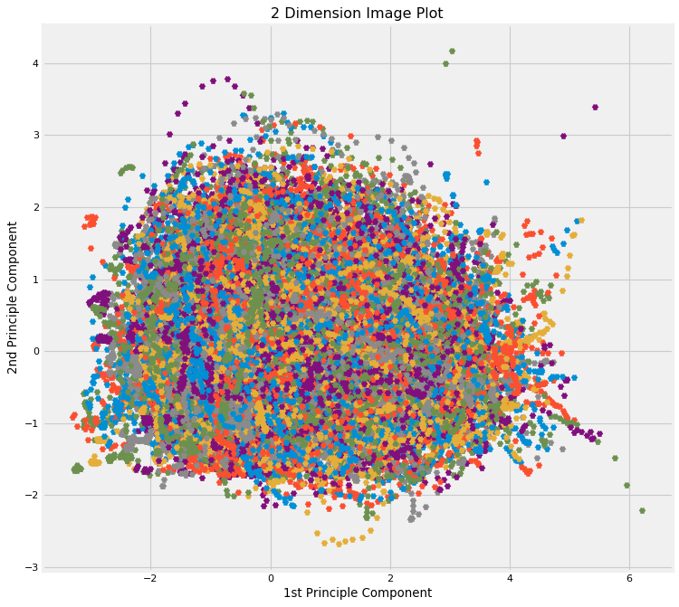


Here I set up myGaussian Mixture models with 6 components, for the 6 crime categories we are considering.
The system plots the data in the background and the image data when testing at the front. This should allow us to tell where our images map to. I never tested the accuracy of this system due to time constraints but I have implemented a neural network at the end to explore the metric side of machine learning.


```python
crime_names_CAT = [crime[0] for crime in crime_names]
crime_nums = set(crime_names_CAT)
crime_nums = {k:v for v,k in enumerate(crime_nums)}
crime_names_CAT = [crime_nums[crime] for crime in crime_names_CAT]

DATA_X, DATA_Y = [], []
for crime in range(len(crime_names_CAT)):
    for pixel in two_dimensional_data[crime]:
        DATA_X.append(pixel)
        DATA_Y.append(crime_names_CAT[crime])
#################################################################################################
X = np.array(DATA_X)
Y = np.array(DATA_Y)  
GMM = GaussianMixture(n_components=6).fit(X) # Instantiate and fit the model
print('Converged:',GMM.converged_) # Check if the model has converged
print("Model fitting done")
means = GMM.means_ 
covariances = GMM.covariances_
   
    
def suspect_report(path, name, contours = True):  
    # Predict
    test_img =  standard_importer(path)[0]
    two_test = plot_components(test_img,["test"],plot=False, dimm =2, size = (5,5))
    #test_image =  pca_reduction(test_img)
    fig = plt.figure(figsize=(10,10))
    ax0 = fig.add_subplot(111)
    prob = [0]*6
    ax0.scatter(X[:,0],X[:,1])
    for pix in two_test[0]:
        Y = np.array([[pix[0]],[pix[1]]])    
        ax0.scatter(Y[0,:],Y[1,:],c='red',marker="X",zorder=10,s=100)
        prediction = GMM.predict_proba(Y.T)
        #print(prob)
        for i in range(len(list(prediction[0]))):
            prob[i] += list(prediction[0])[i]
    ax0.legend(["Originals", f"Test Image {name}"])
    plt.show()
    count = 0
    cum_sum = sum(prob)
    probs = [cum/cum_sum for cum in prob]

    display_image(np.array(test_img), im_names=np.array([f"SUSPECT: {name}"]),columns = 1,rows= 1, size = (5,5))
    print("_________________________________SUSPECTED CRIME PROBABILITIES_________________________________")
    crime_probs = {list(crime_list.values())[i]:probs[i]*100 for i in range(6)}
    dict_printer(crime_probs, name = name)
    print("_______________________________________________________________________________________________")
    print("CRIMES MAP")
        
    return plt
print("DONE")
```

    Converged: True
    Model fitting done
    DONE
    

Now Lets test some cases and see the reports. All of these people are innocent, except you know who so the classifier is definitely wrong.


```python
b = suspect_report('./TEST_IMAGES/Brian/',"Brian")
b
```


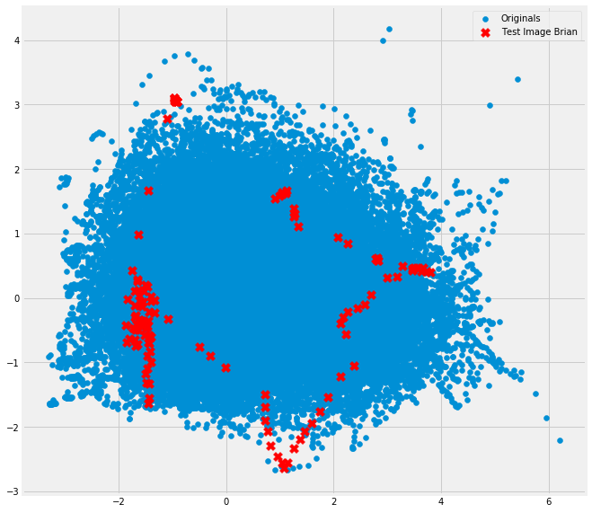


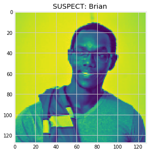


    _________________________________SUSPECTED CRIME PROBABILITIES_________________________________
    
     --------------------------------------------------------------------------------------------------
    The probability of Brian commiting Murder/Assault/Bartery is 19.5875943426853%
    The probability of Brian commiting FRAUD/FAKING DOCUMENTS is 9.450441618493747%
    The probability of Brian commiting THEFT/LACERNY/BUGLARY is 10.283119158444963%
    The probability of Brian commiting SEXUAL MISCONDUCT is 13.625488363047916%
    The probability of Brian commiting DUI is 10.351246519235403%
    The probability of Brian commiting Narcotics/Drugs is 36.70210999809267%
    --------------------------------------------------------------------------------------------------
    
    _______________________________________________________________________________________________
    CRIMES MAP
    


    <module 'matplotlib.pyplot' from 'C:\\Users\\brian\\AppData\\Roaming\\Python\\Python36\\site-packages\\matplotlib\\pyplot.py'>


```python
t = suspect_report('./TEST_IMAGES/Tekashi/',"Tekashi")
t
```


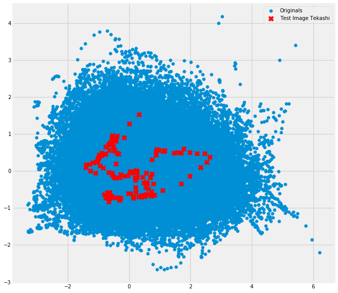


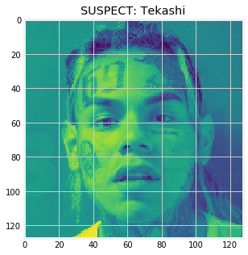


    _________________________________SUSPECTED CRIME PROBABILITIES_________________________________
    
     --------------------------------------------------------------------------------------------------
    The probability of Tekashi commiting Murder/Assault/Bartery is 4.8202946126134565%
    The probability of Tekashi commiting FRAUD/FAKING DOCUMENTS is 39.47589003825222%
    The probability of Tekashi commiting THEFT/LACERNY/BUGLARY is 18.273395799864847%
    The probability of Tekashi commiting SEXUAL MISCONDUCT is 4.928317486195707%
    The probability of Tekashi commiting DUI is 18.82979366726615%
    The probability of Tekashi commiting Narcotics/Drugs is 13.672308395807622%
    --------------------------------------------------------------------------------------------------
    
    _______________________________________________________________________________________________
    CRIMES MAP
    


    <module 'matplotlib.pyplot' from 'C:\\Users\\brian\\AppData\\Roaming\\Python\\Python36\\site-packages\\matplotlib\\pyplot.py'>


```python
bn = suspect_report('./TEST_IMAGES/OSAMA-BIN/',"BIN LADEN")
bn
```


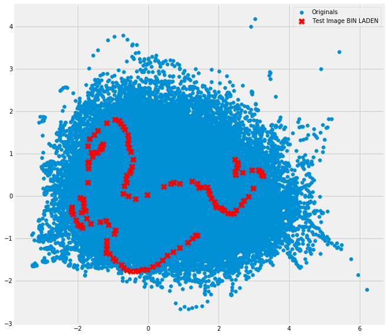


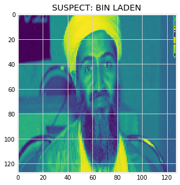


    _________________________________SUSPECTED CRIME PROBABILITIES_________________________________
    
     --------------------------------------------------------------------------------------------------
    The probability of BIN LADEN commiting Murder/Assault/Bartery is 16.487441803221728%
    The probability of BIN LADEN commiting FRAUD/FAKING DOCUMENTS is 14.419510254751652%
    The probability of BIN LADEN commiting THEFT/LACERNY/BUGLARY is 14.521738203307146%
    The probability of BIN LADEN commiting SEXUAL MISCONDUCT is 6.0320300096374995%
    The probability of BIN LADEN commiting DUI is 20.204216146934716%
    The probability of BIN LADEN commiting Narcotics/Drugs is 28.335063582147267%
    --------------------------------------------------------------------------------------------------
    
    _______________________________________________________________________________________________
    CRIMES MAP
    


    <module 'matplotlib.pyplot' from 'C:\\Users\\brian\\AppData\\Roaming\\Python\\Python36\\site-packages\\matplotlib\\pyplot.py'>


```python
st = suspect_report('./TEST_IMAGES/Sterne/',"Le Sterne")
st
```


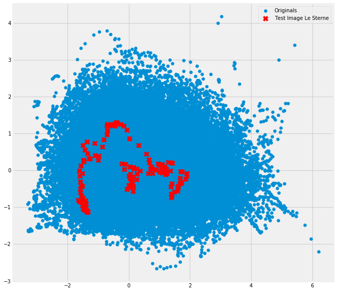


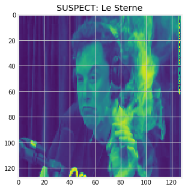


    _________________________________SUSPECTED CRIME PROBABILITIES_________________________________
    
     --------------------------------------------------------------------------------------------------
    The probability of Le Sterne commiting Murder/Assault/Bartery is 5.645900672333922%
    The probability of Le Sterne commiting FRAUD/FAKING DOCUMENTS is 19.92142469986349%
    The probability of Le Sterne commiting THEFT/LACERNY/BUGLARY is 27.072941025985216%
    The probability of Le Sterne commiting SEXUAL MISCONDUCT is 3.79602636005652%
    The probability of Le Sterne commiting DUI is 20.310812598431358%
    The probability of Le Sterne commiting Narcotics/Drugs is 23.252894643329498%
    --------------------------------------------------------------------------------------------------
    
    _______________________________________________________________________________________________
    CRIMES MAP
    


    <module 'matplotlib.pyplot' from 'C:\\Users\\brian\\AppData\\Roaming\\Python\\Python36\\site-packages\\matplotlib\\pyplot.py'>


Our future in Mars is clearly in danger. I hope youre not the one 'driving us to mars' prof.

To illustrate the whole concept, I made this plot of the data against estimates of the gaussian plots that were fitted for the different crimes. If you look at the component plot relative to the data and trace the region, you will realize that depending on where the most points fall, the crimes will have the highest probabilities. All images have a probability but the gaussians indicate where the components of individuals who commit various crimes are likely to lie.


```python
#################################################################################################

#The contours take a long time to compile so I am taking a random, smaller sample to compute contours
print("Contour Plots")
sam_size = 15000
Xs = np.array([X[i] for i in range(sam_size)])
x,y = np.meshgrid(np.sort(Xs[:,0]),np.sort(Xs[:,1]))
XY = np.array([x.flatten(),y.flatten()]).T
count=0

fig = plt.figure(figsize = (15, 15))
pl = fig.add_subplot()
for m,c in zip(means,covariances):
    plt.scatter(Xs[:,0],Xs[:,1], color="orange")
    multi_normal = multivariate_normal(mean=m,cov=c)
    plt.annotate(list(crime_list.values())[count], m,  ha='right', va='bottom',
    bbox=dict(boxstyle='round,pad=0.5', fc='yellow', alpha=0.5),
    arrowprops=dict(arrowstyle = '->', connectionstyle='arc3,rad=0'))
    plt.contour(np.sort(Xs[:,0]),np.sort(Xs[:,1]),multi_normal.pdf(XY).reshape(sam_size,sam_size),alpha=0.3)
    plt.scatter(m[0],m[1],c='red',zorder=10,s=100)
    count+=1
#################################################################################################

plt.show()
```

    Contour Plots
    


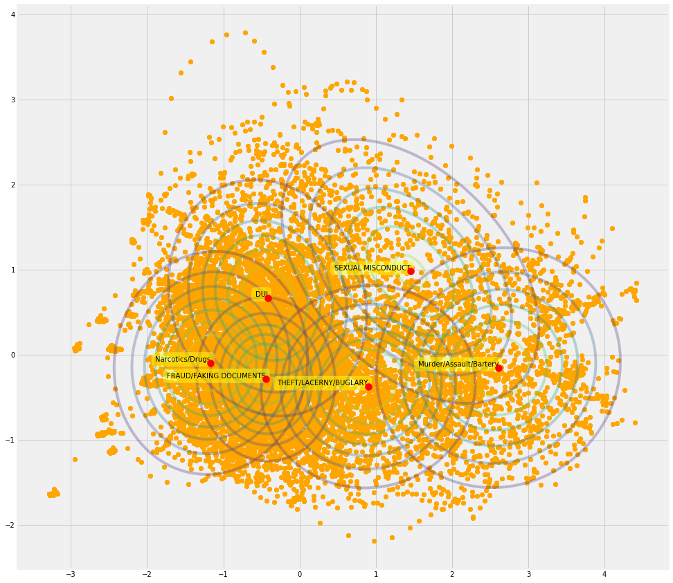


Here is where I put out a disclaimer, the system is made for fun. These were traits from actual criminals, some multiple offendors. Innocent people will aalso be traced out on the plot. This system is based on the assumption that everybody is a criminal which is wrong but hey, in some alternate universe it could be true.

 These conrours extend through all the maps, we have just plotted them about their means. This is why any point will have traces of all the crimes. This is another indicator that the model is definitely not right in real life.
 
 This system also has a lot of innacuracy with the rating since criminals tend to do multiple crimes. There is thus a lot of overlap in features due to this. We can not tell a murdurer from a drunk driver(Okay, maybe we can) but you get the point. This is all for fun and should not be taken seriously. Be a good person. Dont be what this model tell you to be, and if you do, I will not be held accountable for anything! 

# Part 2: 
I needed something that could help me showcase knowledge of accuracy and other metrics so I created a neural network to do classification.

I load the data here and separate it into training and testing sets in a 70:30% ratio.


```python
#!pip install tensorflow --user

import tensorflow as tf

data = MUGSHOTS
labels = [crime_num[crim[0]] for crim in crime_names]
#split then on a 70:30% ratio
seventy = 7*len(data)//10
x_train, y_train, x_test, y_test = np.array(data[:seventy]),np.array(labels[:seventy]), np.array(data[seventy:]), np.array(labels[seventy:])
print(len(x_train))
```

    C:\Program Files (x86)\Microsoft Visual Studio\Shared\Anaconda3_64\lib\site-packages\h5py\__init__.py:36: FutureWarning: Conversion of the second argument of issubdtype from `float` to `np.floating` is deprecated. In future, it will be treated as `np.float64 == np.dtype(float).type`.
      from ._conv import register_converters as _register_converters
    

    546
    

Here, I normalize the data and reshape it to 4 dimensions to allow interfacing with Keras.
My data is shaped 128*128 so I parse this as the input shape of my first Neural network layer. This is the input layer. I am using the Sequential Model from Keras and I add Conv2D , MaxPooling and Dense Layers. Drropout layers fight with overfitting by disregarding some of the neurons while training while flattened layers flatten 2D arrays to 1D arrays before building the fully connected layers.
(TDC: https://towardsdatascience.com/image-classification-in-10-minutes-with-mnist-dataset-54c35b77a38d)


```python
import matplotlib.pyplot as plt
#%matplotlib inline # Only use this if using iPython
image_index = 20 # You may select anything up to 60,000
print(y_train[image_index]) # The label is 8
plt.imshow(x_train[image_index], cmap='Greys')
print(x_train.shape)

# Reshaping the array to 4-dims so that it can work with the Keras API
x_train = x_train.reshape(x_train.shape[0], 128, 128, 1)
x_test = x_test.reshape(x_test.shape[0], 128, 128, 1)
input_shape = (128, 128, 1)
# Making sure that the values are float so that we can get decimal points after division
x_train = x_train.astype('float32')
x_test = x_test.astype('float32')
# Normalizing the RGB codes by dividing it to the max RGB value.
x_train /= 255
x_test /= 255
print('x_train shape:', x_train.shape)
print('Number of images in x_train', x_train.shape[0])
print('Number of images in x_test', x_test.shape[0])


# Importing the required Keras modules containing model and layers
from keras.models import Sequential
from keras.layers import Dense, Conv2D, Dropout, Flatten, MaxPooling2D
# Creating a Sequential Model and adding the layers
model = Sequential()
model.add(Conv2D(128, kernel_size=(3,3), input_shape=input_shape))
model.add(MaxPooling2D(pool_size=(2, 2)))
model.add(Flatten()) # Flattening the 2D arrays for fully connected layers
model.add(Dense(128, activation=tf.nn.relu))#relu activation function for signal processing.
model.add(Dropout(0.2))
model.add(Dense(10,activation=tf.nn.softmax))#softmax activation function for signal processing.


```

    4
    (546, 128, 128)
    x_train shape: (546, 128, 128, 1)
    Number of images in x_train 546
    Number of images in x_test 235
    

    Using TensorFlow backend.
    


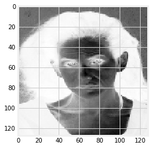


I compile my model and review the accuracys and loss values.

We have pathetic accuracy with the model. With all due honesty, I am really glad we have this. Not because the model is bad but it goes to justify the weaknesses in the Gaussian mixtures. You cannot tell the difference between a murderer and a DUI person from their facial features. There is no known correlation between the two.

Our accuracy level tells us that the machine got it right only about a quater of the time at approximately 0.25.

The reasons are similar, the components that are attributed to any of the groups vary. It is why it is rather hard to converge to one model that can tell you which person is which criminal.

Our loss may have reduced, but this was not exactly a significant reduction. It tells us that how well the model is performing for the training and testing sets. Our accuracy is telling us the proportion we got right  and clearly, we aare not doing well.


```python
model.compile(optimizer='adam', 
              loss='sparse_categorical_crossentropy', 
              metrics=['accuracy'])
model.fit(x=x_train,y=y_train, epochs=10)
```

    Epoch 1/10
    546/546 [==============================] - 33s 61ms/step - loss: 1.7238 - acc: 0.2289
    Epoch 2/10
    546/546 [==============================] - 31s 57ms/step - loss: 1.5881 - acc: 0.2674
    Epoch 3/10
    546/546 [==============================] - 31s 57ms/step - loss: 1.5060 - acc: 0.2564
    Epoch 4/10
    546/546 [==============================] - 30s 55ms/step - loss: 1.4295 - acc: 0.2949
    Epoch 5/10
    546/546 [==============================] - 30s 56ms/step - loss: 1.4897 - acc: 0.2821
    Epoch 6/10
    546/546 [==============================] - 31s 56ms/step - loss: 1.4440 - acc: 0.2802
    Epoch 7/10
    546/546 [==============================] - 31s 57ms/step - loss: 1.4073 - acc: 0.2875
    Epoch 8/10
    546/546 [==============================] - 31s 57ms/step - loss: 1.4060 - acc: 0.2747
    Epoch 9/10
    546/546 [==============================] - 31s 58ms/step - loss: 1.4274 - acc: 0.3095
    Epoch 10/10
    546/546 [==============================] - 31s 56ms/step - loss: 1.4145 - acc: 0.3022
    


    <keras.callbacks.History at 0x110a12adc50>


Our accuracy and loss get even worse when we try the model on the test data. At this moment it is safe to assume the machine is guessing the outcomes because even they just cannot tell a murderer by the look of their face.


```python
model.evaluate(x_test, y_test)
```

    235/235 [==============================] - 3s 11ms/step
    


    [5.10400146119138, 0.0]


Nonetheless, lets have some fun. Lets see what our very judgemental Model thinks of certain people.


```python
from PIL import Image
import requests
from io import BytesIO

def test_image(new=False, image_index = 28, link = None):
    if not new:
        image_index = 5
        plt.imshow(x_test[image_index].reshape(128, 128))
        pred = model.predict(x_test[image_index].reshape(1, 128,128, 1))
        print(crime_bn[pred.argmax()])
        print(crime_bn[labels[image_index]])
    else:
        response = requests.get(link)
        img = Image.open(BytesIO(response.content))
        img = imtran.resize(np.array(img.convert('L')), (width,width), mode = "reflect")
        pred = model.predict(img.reshape(1, 128,128, 1))
        print(f"We are not sure what your friend here is but our sources say he is a {crime_bn[pred.argmax()]} convict")
        plt.imshow(np.array(img).reshape(128, 128))
    plt.show()
#OSAMA TEST
test_image(new=True, link = "https://cdn.cnn.com/cnnnext/dam/assets/120523120531-osama-bin-laden-large-169.jpg")
brian = "https://miro.medium.com/max/2400/1*yeRFo0QJyrFsxE2cEoiM0Q.jpeg"
test_image(new=True, link = brian)
#feel free to test it with our good friend here:
elon_musk = "https://d33z52hfhvk3mr.cloudfront.net/s3_proxy/minervaschools-production-cms-uploads/images/Philip_Sterne.width-1104.jpg"
#test_image(new=True, link = elon_musk)

```

    We are not sure what your friend here is but our sources say he is a Murder/Assault/Bartery convict
    


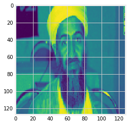


    We are not sure what your friend here is but our sources say he is a Murder/Assault/Bartery convict
    


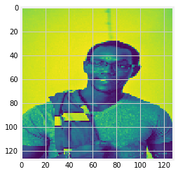

